[Movies-Lovers](https://npgonzalez.github.io/SCL012-Movies-Lovers/src/)

# Movie Lovers

## 1. Resumen del proyecto

Movie Lovers fue creado para los amantes de las películas de súper héroes, y como siempre hay fans que defienden a Marvel, otros a DC comics, y algunos les gusta tanto ambos que no logran decidir por uno. Por esto hemos creado esta página, para saber cuánto saben de los universos creados en las películas de Dc Comics y Marvel.
Cada universo cuenta con una trivia en la que si respondes correctamente, sabrás si eres realmente un experto en tu Liga Favorita.
Además está la información de cada película para que puedas saber y comprobar tus respuestas.

## UX
Hicimos una investigación sobre las películas más taquillas del año 2019 y como muestra esta página [link](https://spoiler.bolavip.com/cuales-son-las-peliculas-mas-taquilleras-con-mayor-recaudacion-de-2019-t201912300003.html), todos los años vemos estrenos de películas de Marvel o DC comics, ya que sus infinitos universos no tienen cuando acabar y siempre será éxito tener en estreno una película de súper héroes.
Y como la discusión viene desde mucho antes de cuál es la mejor liga y sus comparativos de personajes, se creó Movie Lovers para saber qué tan fanático eres, si puedes responder todo correcto y además tener información detallada de cada una de las películas de amos universos.

Diseñamos una aplicación que tuviera bastante gráfica de las peliculas y instuitivo, para que sea amigable y sea asociativo con sus mundos.

### Prototipos
Nuestro primer prototipo de baja fidelidad

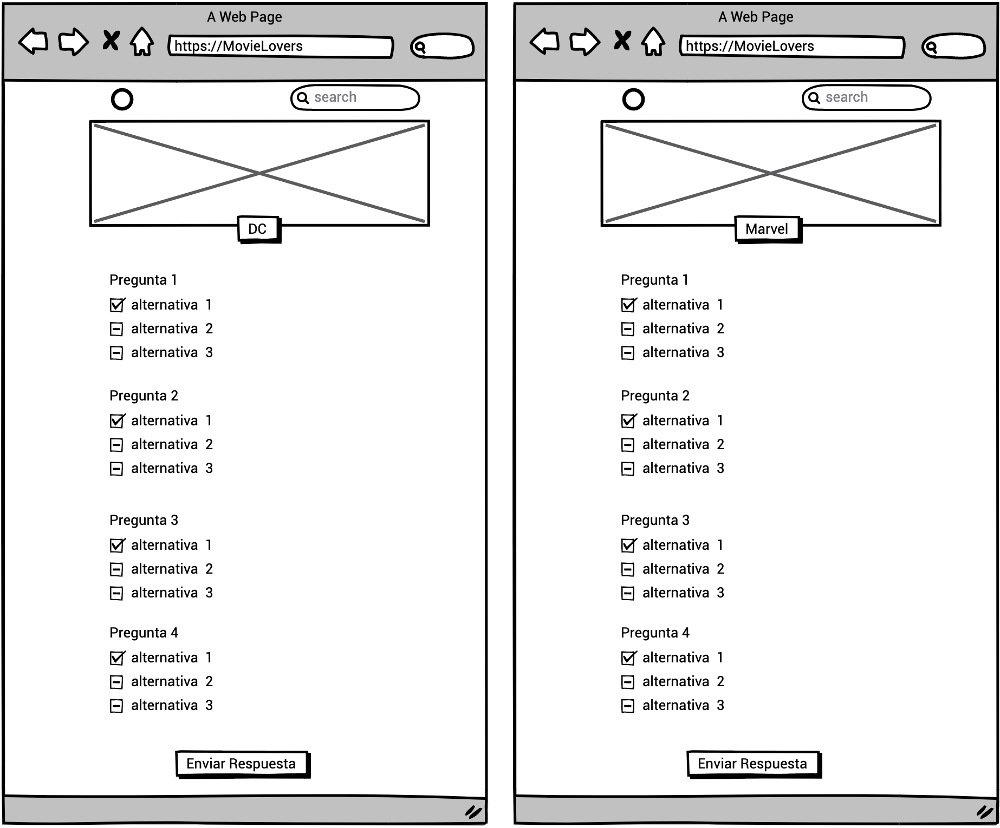
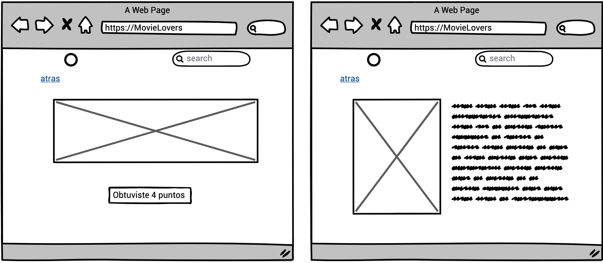

Flujo de usuario a través de la página 
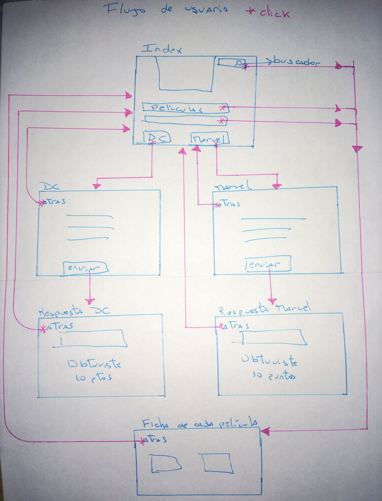

Nuestro prototipo de figma de alta fidelidad 
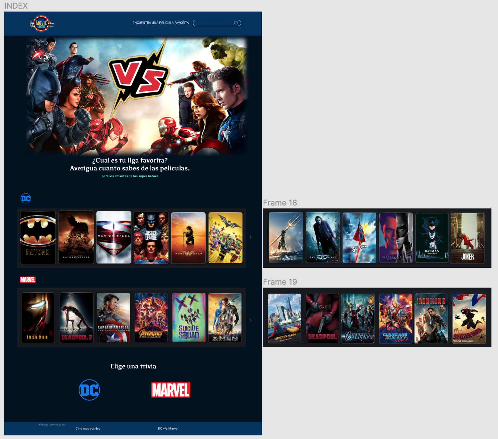

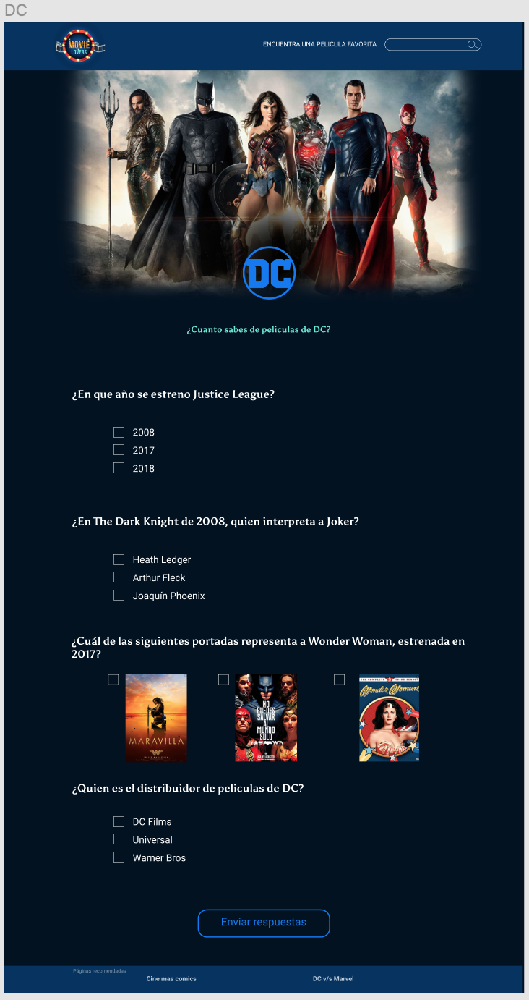

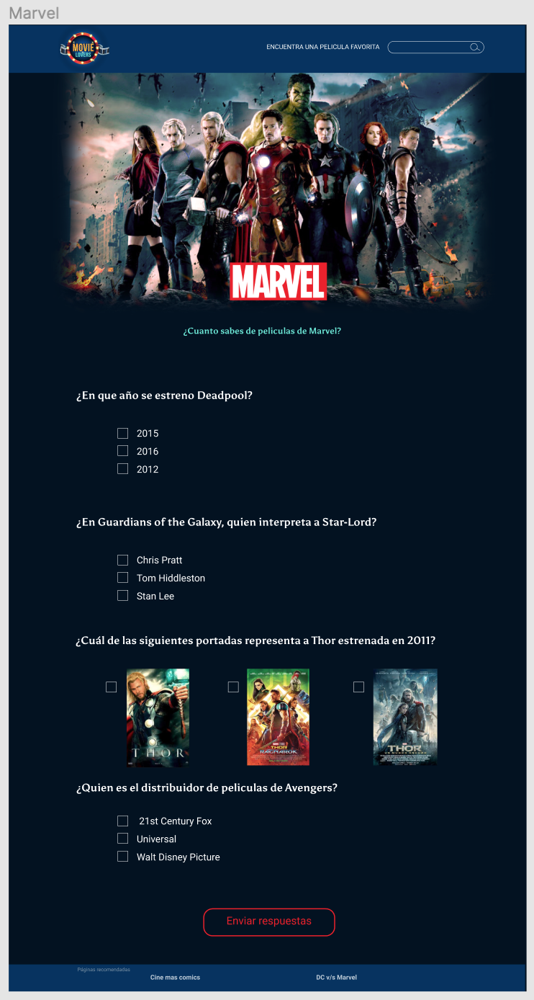

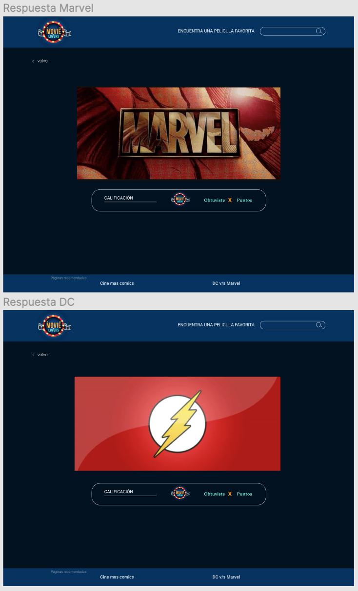

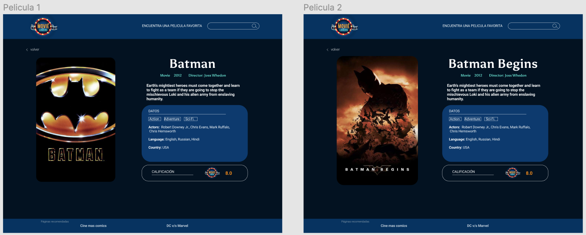

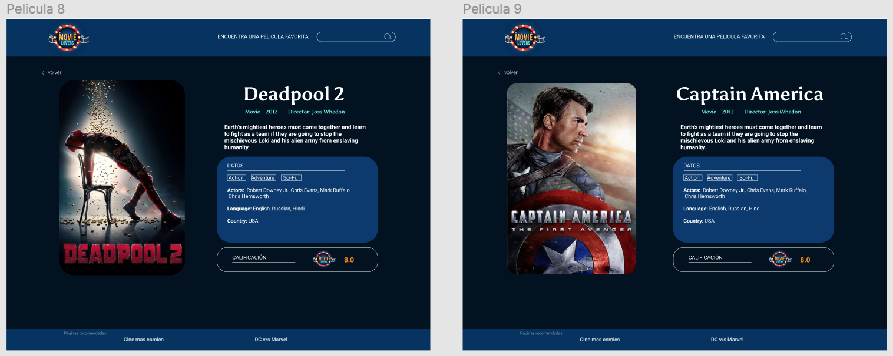

Nuestro prototipo de figma de alta para movil
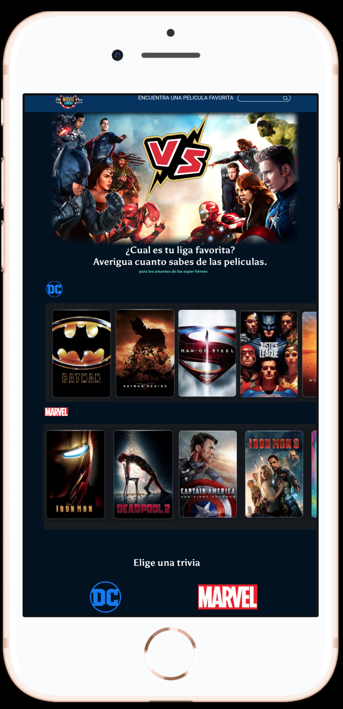

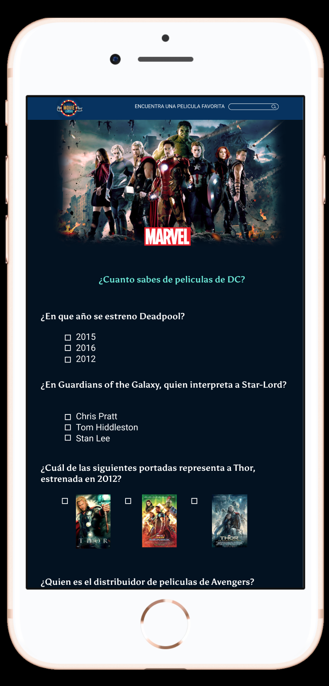

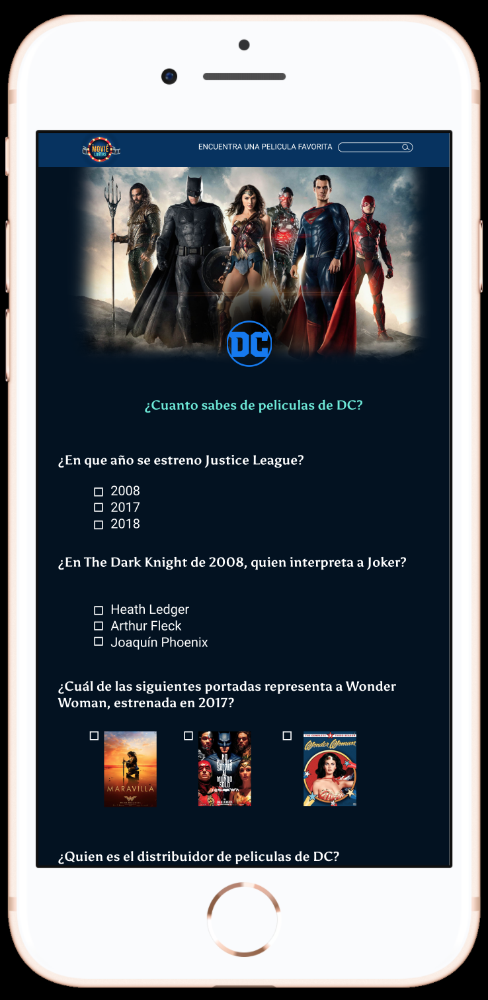

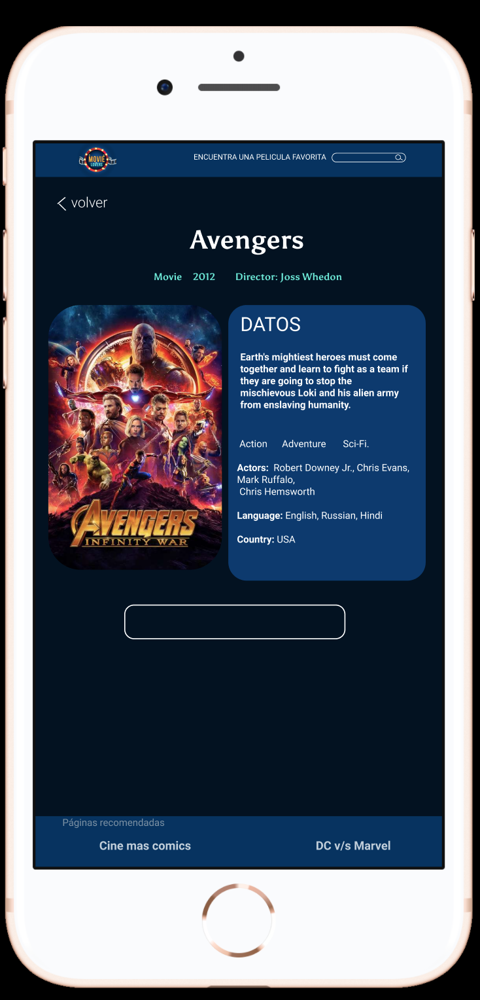

#### Prototipo Final
Prototipo de alta fidelidad con interacción  [link](https://www.figma.com/proto/uDih1yTKbiDosgZcreA3xq/Untitled?node-id=1%3A2&scaling=min-zoom)

### Test de Usabilidad
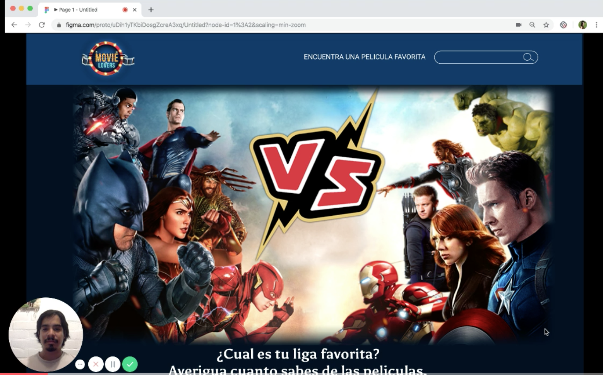
\* Test Usabilidad 1 [link](https://www.loom.com/share/b28173b491414e9b98b986afd9d606ad)

Test de usuario con prototipo interactivo de figma.
##### Bastián, fans de DC hace el test e indica que le parece atractiva la página, y el enfoque que le dimos, logra hacer sin problemas lo solicitado, que es jugar una trivia. Solo acotó una información errónea que aparecia de una película.

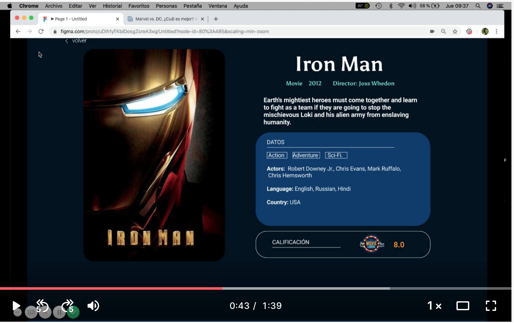
\* Test Usabilidad 2 [link](https://www.loom.com/share/062ce4988ad541a894ca71c2cc510bbf)

Test de usuario con prototipo interactivo de figma.
##### Carolina, hizo el test pero no quizo ser grabada, solo aparece la interacción con la página. Le parece graficamente atractivo, no tuvo problemas con entrar a hacer una trivia, como se le solicitó, pero indica que le gustaria tener mas información sobre los personajes y no solo que aparezca la descripción de la película.

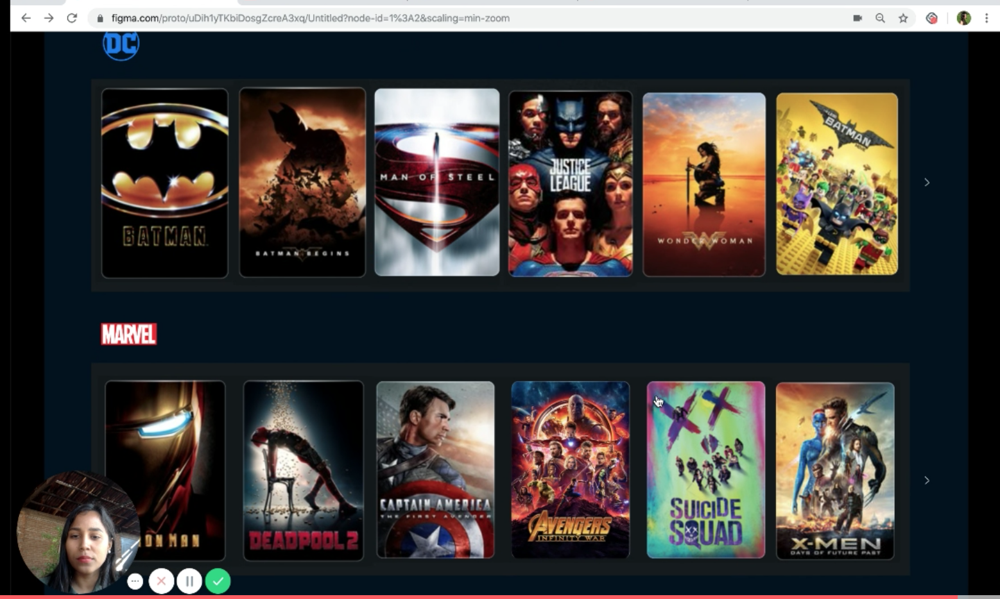
\* Test Usabilidad 3 [link](https://www.loom.com/share/72d01226ce13479f92b867913bedbd16)

Test de usuario con prototipo interactivo de figma.
##### Crusiris, es usuaria de películas en general, no tiene preferencia por alguna. Le gusto, no tuvo problemas con entrar a hacer una trivia, como se le solicitó. Se le pregunta por sugeencias, he indica que esta todo bien para ella, solo ciertas interfaces que no resultan bien porque es el prototipo y no la página real, como el buscador especifico.
(por la instabilidad del internet el video no se guardo completo :(, pero lo ingreso de todas formas).

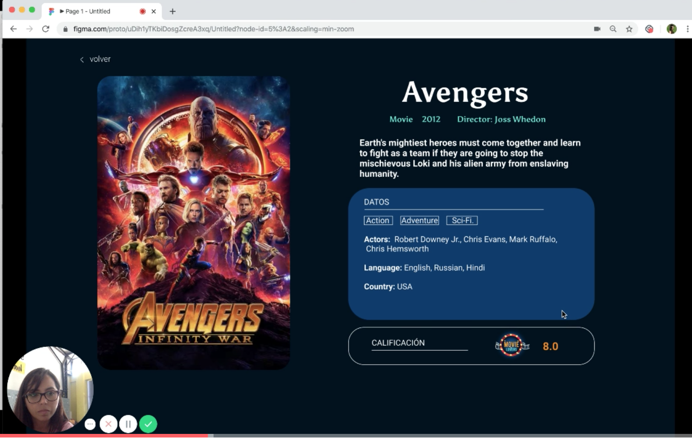
\* Test Usabilidad 4 [link](https://www.loom.com/share/9a7b0b95008f456d83fce7514bffdd5b)

Test de usuario con prototipo interactivo de figma.
##### Vanesa, ha visto mas películas de marvel, en cuanto a diseño no ha hecho mayor acotación, si le parece confuso la información de la película que pensó que ahí se jugaba a ña trivía.

Conclusiones: como el primer titulo es averigua cunato sabes de las películas y luego aparace el catálogo, el usuario tiende a creer que ahí esta el juego, por lo que subiría la trivía y luego abajo poner el catálogo de películas, que diga "mira a tu súper héroe favorito".

### Test con página final e Historia de usuario

Nuestro objetivo fue que el usuario pudiera navegar en la página y completar una de las  trivias, además que pudiera ver la descripción de una pelicula por busqueda o biblioteca.

*La página aun esta en proceso de ejecución por lo que no se puedieron hacer test ni historia de usuario.

## Organización del proyecto
En este proyecto nos organizamos de la siguiente manera 
[link trello](https://trello.com/b/AvYZB2oD/peliculas)

-Nayaret Gonzalez hizo ayuda a investigación de mercado para ejecutar la idea, master en github, creó el repositorio y Dom con toda la ejecutación de botones y funciones para llamar a las películas según buscadores especifico.

-Geraldine Becerra hizo todo el html semantico,estructura, manejo de css, investigación y ejecución de framework. Llevar el trello al día.

-Nerymar Guarni hizo la creación de la ficha de cada película, al hacer el llamado del Dom, muesra la informacion de cada película con sus detalles.

-Anais Gonzalez hizo invenstigación de mercado para ejecutar la idea, generar una imagen para el diseño de la página, creación de guía de estilos. 
Modificación y actualización de trello.
Prototipo de baja con flujo de usuario.
Prototipo de alta, testeo e este con usuarios y testeo con la página en funcionamiento para cumplir la historia de usuario.